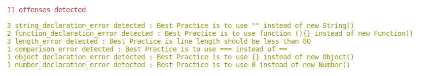

# Gilinter - A Microverse Ruby Capstone Project
> In this project, Ibuild my own linter that will make life easier for a developer

> I decided to implement a JavaScript Linter that utilises JavaScript Best Practices as documented on w3schools website https://www.w3schools.com/js/js_best_practices.asp

# Project Specifications
- A linter developed in Ruby
- It's a linter for beginners, i.e., it provides feedback about errors or warning in code little by little
- You choose the rest of the functionality for the linter
# How to run the tests
- Download or clone the repository's files github repo
- Have Ruby 2.7 installed (to check if it is installed you can run: ruby -version in your console)
- Once repo is downloaded to local directory, in you console run cmd: ruby ./bin/main.rb
# Dependancies 
- the project includes the Ruby gem "colorize" for colorizing text using ANSI escape sequences. 
## To Install
- open command prompt
- gem install colorize

# Screenshot

## Built With

- Ruby (version <= 2.7.0)

## Live Demo

[Live Demo Link](https://repl.it/@GilbertGotora/gilinter-ruby-capstone#README.md)

## Author

👤 Gilbert Gotora

- Github: [@ggotora](https://github.com/ggotora)
- Linkedin: [@gilbert_gotora](https://www.linkedin.com/in/gilbert-gotora)

## 🤝 Contributing

Contributions, issues, and feature requests are welcome!

Feel free to check the [issues page](https://github.com/ggotora/gilinter-ruby-capstone/issues).

# Show your support

Give a ⭐️ if you like this project!

## Acknowledgments

- Microverse
- GitHub

## 📝 License

This project is [MIT](LICENSE) licensed.

## 📝 Credits

This project was done by Gilbert Gotora
